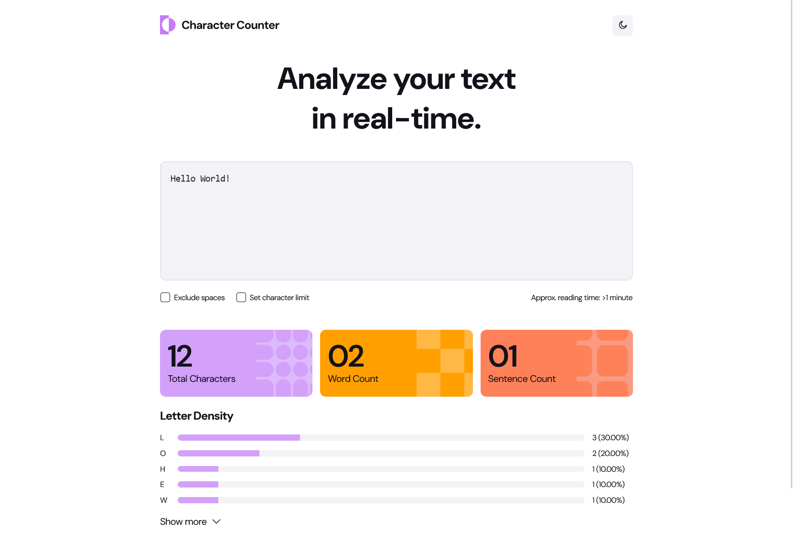

# Character counter

## Project overview

Character Counter is an application for counting characters, words and sentences for the given text in real-time.

Project is a solution for Frontend Mentor challenge:
[Frontend Mentor - Character Counter](https://www.frontendmentor.io/challenges/character-counter-znSgeWs_i6)

## How to run

The application is available at:
https://charscounter-kwlodarczyk.netlify.app/

## Features

- Real-Time Metrics: Provides instant updates for total characters, word count, and sentence count.
- Letter Density Report: Calculates and displays the frequency of individual letters.
- Character Limiter: Implements an optional, configurable character limit with real-time validation and error messaging.
- Modern UI: Features responsive design, a dark mode, and clean CSS implementation with CSS Variables.

## Tech stack

- HTML
- CSS
- JavaScript
- Test automation (Cypress)

## Quality Assurance: QA-First approach

This project has strong software quality approach. The project is supported by 61 documented test cases which validate all core functionalities of the app. 52 of them are fully automated.
The full test case suite is generated from a JSON file and rendered to an accessible HTML structure and is available by clicking button 'Test cases' on the bottom of the main page.

### Test automation

Test automation uses various assertions (e.g., visibility, text content, element count). Tests are written using custom commands (commands.js) to make tests easier to read and maintain.
Report from automation tests is available by clicking button 'Cypress report' on the bottom of the main page. All automation tests are located in one spec file. Areas of functionalities are divided into describe blocks.

Locations:
Spec.cy.js: `cypress/e2e/spec.cy.js`
Commands.js: `commands.js`

By default, tests are running on address:
https://charscounter-kwlodarczyk.netlify.app/

This setting can be changed by changing baseUrl in file `cypress.config.js`.
